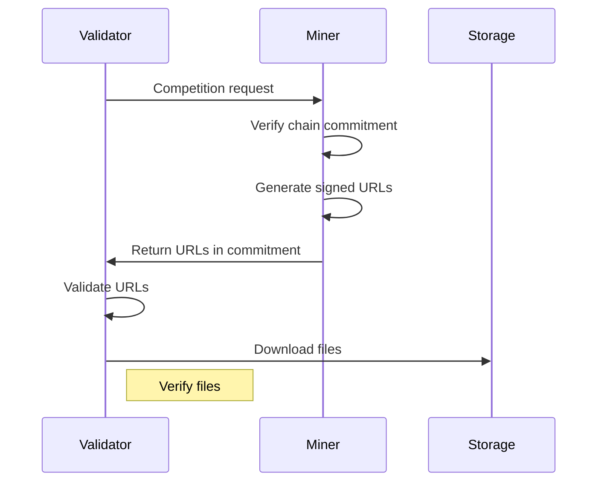

# Competition System Technical Documentation

## Overview

The competition system enables miners to submit optimized circuits that are evaluated by validators. Due to large file sizes (particularly proving keys), the system uses cloud storage (R2/S3) for file distribution.

## Architecture

### Components

1. **CircuitManager** (Miner-side)

   - Manages circuit files and storage
   - Handles R2/S3 uploads
   - Manages chain commitments
   - Provides signed URLs to validators

2. **CircuitManager** (Validator-side)

   - Downloads circuit files using signed URLs
   - Validates URLs and file integrity
   - Manages temporary storage
   - Cleans up after evaluation

3. **Competition Protocol**
   - Chain commitment: SHA256 hash of verification key
   - File distribution: Signed R2/S3 URLs
   - Required files: vk.key, pk.key, settings.json, model.compiled

### Security Model

1. **Chain Commitment**

   - VK hash stored on-chain
   - Prevents circuit switching after commitment
   - Enables validator verification

2. **File Distribution**

   - Time-limited signed URLs
   - Domain validation for R2/S3
   - Atomic state updates
   - Thread-safe operations

3. **Validation**
   - Hash verification before download
   - URL domain validation
   - Required file verification

## Implementation

### Miner Setup

1. Configure storage credentials in config:

```python
config = {
    "storage_provider": "r2",  # or "s3"
    "bucket": "your-bucket",
    "account_id": "your-account-id",
    "access_key": "your-access-key",
    "secret": "your-secret"
}
```

2. Required circuit files:

```
circuit_dir/
  ├── vk.key
  ├── pk.key
  ├── settings.json
  └── model.compiled
```

### Flow

1. **Validator Request Flow**



### Error Handling

1. **Chain Commitment**

   - Miner verifies local VK hash matches chain
   - Returns empty response on mismatch
   - Logs error with hash details

2. **URL Generation**

   - Validates all required files exist
   - Returns error if URL generation fails
   - Logs failures per file

3. **Downloads**
   - Validates URL domains
   - Retries failed downloads
   - Cleans up partial downloads

## Best Practices

### Miners

1. **File Management**

   - Keep circuit files in designated directory
   - Verify files before commitment
   - Monitor storage usage

2. **Security**
   - Secure storage credentials
   - Set appropriate URL expiry
   - Monitor URL usage

### Validators

1. **Download Strategy**

   - Validate URLs before download
   - Clean up temporary files
   - Cache common files

2. **Security Checks**
   - Verify URL domains
   - Check file integrity
   - Validate commitment data

## Configuration

### Required Settings

```python
COMPETITION_CONFIG = {
    # Storage Settings
    "storage_provider": str,  # "r2" or "s3"
    "bucket": str,
    "account_id": str,
    "access_key": str,
    "secret": str,

    # Circuit Settings
    "circuit_dir": str,
    "netuid": int
}
```

### Required Files

1. **Verification Key (vk.key)**

   - Binary format
   - Required for commitment
   - Hash used on-chain

2. **Proving Key (pk.key)**

   - Binary format
   - Required for proofs
   - Size varies

3. **Settings (settings.json)**

   - JSON format
   - Circuit parameters
   - Required for setup

4. **Model (model.compiled)**
   - Compiled circuit
   - Required for execution
   - Format specific to EZKL

## Monitoring

### Key Metrics

1. **Chain State**

   - Commitment updates
   - Hash verification
   - Timing data

2. **File Operations**
   - Download success/failure
   - URL validation
   - Storage usage

### Logging

```python
bt.logging.info("Downloading circuit files...")
bt.logging.error(f"Invalid URL domain: {url}")
bt.logging.success("Circuit files downloaded successfully")
```

## Troubleshooting

### Common Issues

1. **Hash Mismatch**

   - Check chain commitment
   - Verify local VK hash
   - Check file integrity

2. **URL Issues**

   - Validate domain whitelist
   - Check URL expiry
   - Verify all required files

3. **Download Failures**
   - Check network connectivity
   - Verify URL validity
   - Clean up partial downloads
