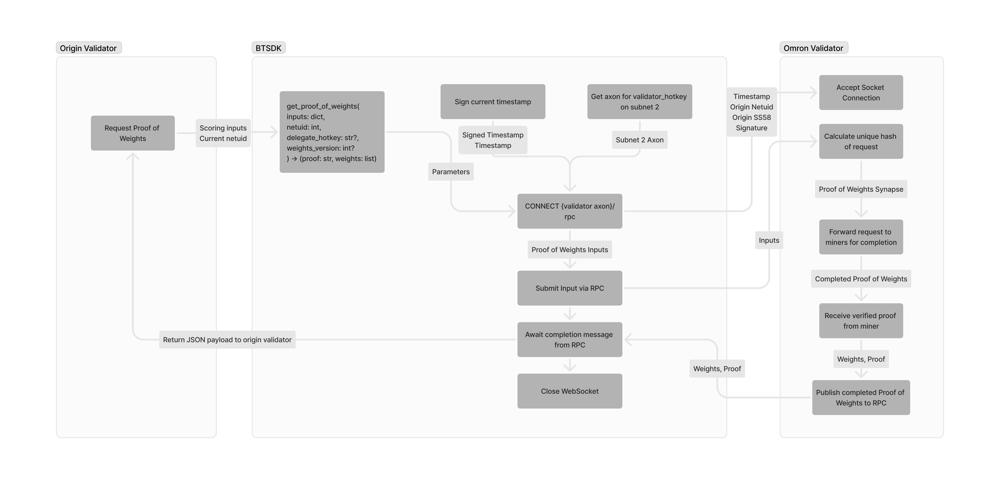
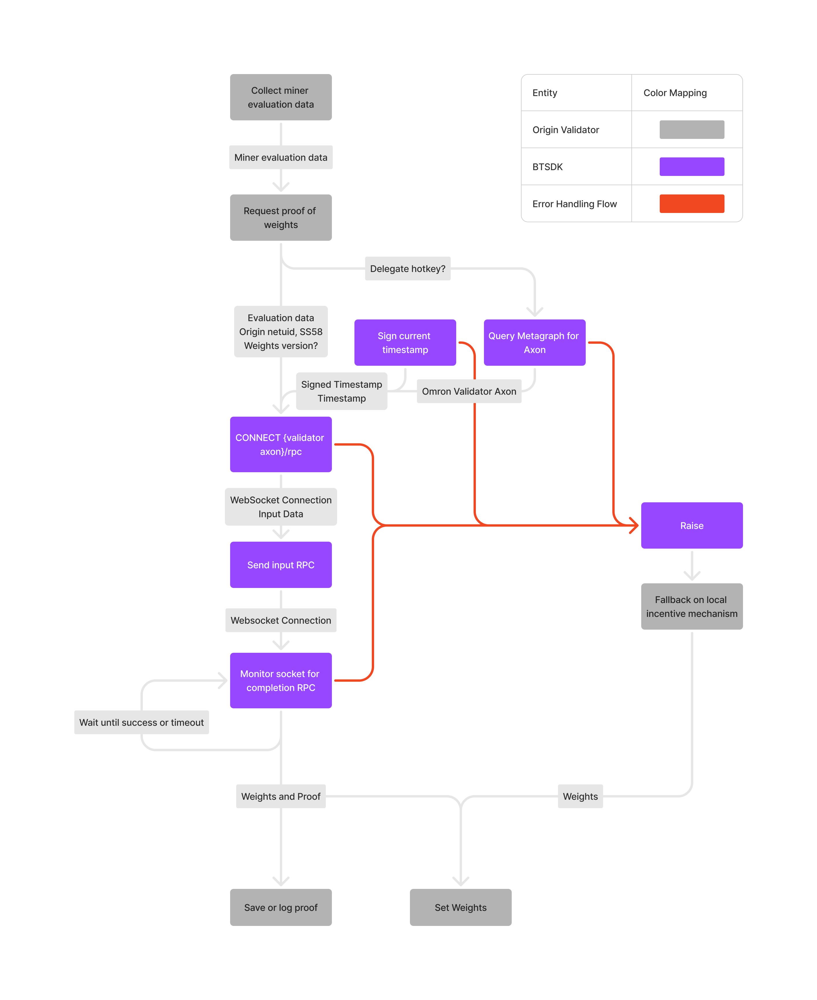

# BTSDK Integration Plan

The scope of this document includes an overview of Proof of Weights as a feature, and detailed instructions for implementation within the BTSDK.

## Introduction

Proof of Weights is a feature that allows validators within Bittensor to prove that they have correctly and faithfully run each subnet's incentive mechanism as per the subnet owner's specification. This allows trustless verification of validator behavior across subnets.

To achieve this, Omron (Bittensor subnet 2) has created several reference implementations of Proof of Weights mechanisms which it continues to expand to cover an increasing amount of the subnet landscape. Technically, Proof of Weights is implemented through the use of Zero Knowledge Circuits, which represent the subnet's incentive mechanism as a set of constraints.

One of the trade-offs of Proof of Weights is that it requires a significant amount of computational resources to produce a proof. This is why Omron has positioned itself as the "execution layer" for Proof of Weights, showing the capability of producing over 300,000 proofs per day. By leveraging Omron as an extremely performant decentralized proving cluster that constantly evolves to support the growing needs of the Bittensor network, validators can trustlessly prove their compliance with the incentive mechanism of any subnet.

At present, the [Proof of Weights SDK] provided by the Inference Labs team exists to support the integration of Proof of Weights into existing validator codebases. This SDK is fully featured and serves as a reference implementation for integration with the BTSDK. Once integrated, adoption of Proof of Weights will be easier than ever as all validators already leverage BTSDK to interact with the Bittensor network.

Changes are in progress to update the Proof of Weights validator API to support JSON-RPC based WebSocket communication, which will reduce the complexity of the integration and make it easier to support additional proving services in the future.

## Architecture Overview

At a high level the architecture of Proof of Weights is illustrated in the below diagram and described in the following steps.



### Origin Validator

- Responsible for collecting the necessary miner evaluation data for an epoch.
- Maintains a fallback incentive mechanism for when Proof of Weights is not available.
- Calls `bt.proof_of_weights`, providing their current `netuid`, their evaluation data, an optional delegate hotkey and optional weights version.
- Optionally stores and/or logs the proof to WandB.

### BTSDK

- Serves as an interface between the Origin Validator and Omron Validator, facilitating the communication and data flow between them.
- Uses the validator's hotkey to sign over a timestamp.
- Queries the metagraph of the Omron Subnet to get the axon information for the delegate hotkey.
- Opens a WebSocket connection to the Omron Validator, providing the signed timestamp as a header.
- Provides the request body to the Omron Validator through the open WebSocket connection.
- Waits for the proof to be completed by the Omron Validator.
- Closes the WebSocket connection once the proof is received.
- Returns the payload back to the Origin Validator.
- Responsible for raising exceptions if the Proof of Weights request fails for any reason.

### Omron Validator

- Produces Proof of Weights proofs for Origin Validators.
- Accepts WebSocket connections from the BTSDK, verifying liveness through the signed timestamp header.
- Accepts and responds to requests for proof of weights through the WebSocket connection.

## Logical Workflow

1. An Origin Validator collects the necessary miner evaluation data for an epoch.
2. The Origin Validator calls `bt.proof_of_weights`, providing their current `netuid`, their evaluation data, optionally a delegate hotkey and a weights version.
3. The BTSDK uses the validator's hotkey to sign over a current timestamp.
4. The BTSDK queries the metagraph of the Omron Subnet to get the axon information for the delegate hotkey.
5. The BTSDK submits a WebSocket CONNECT request to the Omron Validator's axon with the signed timestamp, netuid, and delegate hotkey as headers.
6. The BTSDK uses the WebSocket connection to send the evaluation data to the Omron Validator.
7. The BTSDK waits with a timeout for the proof to be completed by the Omron Validator.
8. Once the proof is ready, the BTSDK returns the payload back to the Origin Validator.
9. The Origin Validator optionally stores and/or logs the proof to WandB.
10. The Origin Validator submits weights to the chain, provided from the Proof of Weights payload.

As illustrated in the below workflow diagram, there are several logical steps to consider when integrating Proof of Weights into the BTSDK.



### Delegate Hotkey

1. If the Origin Validator does not have a delegate hotkey, the BTSDK will automatically use the Origin Validator's hotkey.
2. If the Origin Validator does have a delegate hotkey, the BTSDK will use the provided delegate hotkey.

### Weights Version

1. If the Origin Validator does not provide a weights version, the Omron Validator will choose the most up to date weights version for the provided netuid, automatically.
2. If the Origin Validator does provide a weights version, the Omron Validator will use the provided weights version to select the correct proving circuit.

### CONNECT request to Omron Validator

1. If the CONNECT request to the Omron Validator fails for any reason, the BTSDK will raise an exception and the Origin Validator _should_ fallback to the default weight calculation logic.
2. If the CONNECT request to the Omron Validator succeeds, the BTSDK will open a WebSocket connection to the Omron Validator, providing the signed timestamp as a header.

### Awaiting Proof Completion

1. The BTSDK will maintain an open WebSocket connection with the Omron Validator for up to 2 minutes, waiting for the proof to be sent back through the connection.
2. If the WebSocket connection is closed unexpectedly or times out after 2 minutes, the BTSDK will raise an exception and the Origin Validator _should_ fallback to the default weight calculation logic.
3. Once the proof is received through the WebSocket connection, the BTSDK will return the payload back to the Origin Validator.

## CONNECT Request Specification

### Endpoint

The endpoint for WebSocket connections is described as `wss://{validator ip}:{validator port}/rpc`.

### Headers

| Key             | Required | Description                                                                   |
| --------------- | -------- | ----------------------------------------------------------------------------- |
| `x-netuid`      | Yes      | The `netuid` of the subnet that the Origin Validator is running on.           |
| `x-origin-ss58` | Yes      | The SS58 address of the Origin Validator.                                     |
| `x-signature`   | Yes      | A SS58 signature made by `x-origin-ss58`, containing the `x-timestamp` value. |
| `x-timestamp`   | Yes      | A Unix timestamp of when the request was created.                             |

### Status Codes

- `101` - The WebSocket connection was successfully established.
- `403` - Authentication failed, and no connection will be established.

## JSON-RPC Specification

### Requesting Proof of Weights

The following [JSON-RPC] request will request a Proof of Weights proof from the Omron Validator.

| Key               | Required | Description                                                                                                                                                  |
| ----------------- | -------- | ------------------------------------------------------------------------------------------------------------------------------------------------------------ |
| `evaluation_data` | Yes      | The evaluation data for the epoch, as a JSON object.                                                                                                         |
| `weights_version` | No       | The version of the weights to use for the proof, as an integer. If not provided, the subnet will choose the most up to date circuit for the netuid provided. |

```json
{
  "jsonrpc": "2.0",
  "method": "omron.proof_of_weights",
  "params": {
    "evaluation_data": {...},
    "weights_version": ...
  },
  "id": 1
}
```

### Response

Once complete, the Omron Validator will return the Proof of Weights proof to the BTSDK in the form of a JSON-RPC response.

| Key       | Description                                         |
| --------- | --------------------------------------------------- |
| `proof`   | The Proof of Weights proof, as a JSON object.       |
| `weights` | The weights for the proof, as an array of integers. |

```json
{
  "jsonrpc": "2.0",
  "result": {
    "proof": {...},
    "weights": [...]
  },
  "id": 1
}
```

### Errors

Should an error occur, the Omron Validator will return an error response in the form of a [JSON-RPC] error response.

| Key       | Description                        |
| --------- | ---------------------------------- |
| `code`    | The error code, as an integer.     |
| `message` | The error message, as a string.    |
| `data`    | Additional data, as a JSON object. |

```json
{
  "jsonrpc": "2.0",
  "error": {
    "code": ...,
    "message": "...",
    "data": {...}
  },
  "id": 1
}
```

## Security Considerations

### Signature Verification

To remove the risk of DDOS and related flooding attacks, each call to the Omron Validator's API is protected by signature verification. This means that only validators that have a VPermit on their claimed origin subnet can use the Proof of Weights service. Liveness is guaranteed through the use of a timestamp within each signature, preventing replay attacks.

- Signature provided must match the timestamp and ss58 address provided in the headers.
- Timestamp must be within the last 5 minutes to prevent replay attacks.
- Origin SS58 address must either:
  - Be explicitly whitelisted by the Omron Validator
  - Be present in the metagraph of the origin subnet, and have a VPermit on the origin subnet

### Proof Verification

Omron validators check that the proof provided by the miner is fully verified before returning the proof to the BTSDK, ensuring cryptographic security.

### Transport Layer Security

The BTSDK and Omron Validator communicate over a secure TLS-encrypted WebSocket connection using the [WSS] protocol.

## Definitions

| Term             | Definition                                                                                                                                                                             |
| ---------------- | -------------------------------------------------------------------------------------------------------------------------------------------------------------------------------------- |
| Delegate Hotkey  | A hotkey not controlled by the Origin Validator that is used to produce the Proof of Weights proof. If no delegate hotkey is provided, the Origin Validator will use their own hotkey. |
| Epoch            | A 360 block period that defines intervals at which consensus is calculated on the Bittensor network.                                                                                   |
| `netuid`         | A unique identifier for a subnet on the Bittensor network.                                                                                                                             |
| Omron Subnet     | Subnet number 2 on the Bittensor network which serves as a decentralized proving service for Proof of Weights and is operated by Inference Labs.                                       |
| Omron Validator  | A validator operating on the Omron subnet, which is responsible for producing Proof of Weights proofs for Origin Validators.                                                           |
| Origin Validator | A validator operating on any subnet within the Bittensor network, which requests a Proof of Weights proof from a remote proving service.                                               |
| Proof of Weights | A mechanism that allows validators to prove that they have correctly and faithfully run each subnet's incentive mechanism as per the subnet owner's specification.                     |
| Proving Service  | A remote service that produces Proof of Weights proofs for Origin Validators, in this case Omron (Subnet 2).                                                                           |
| Subnet           | A specialized network within Bittensor that serves a specific purpose or runs a particular type of service.                                                                            |
| TAO              | The native token of the Bittensor network used for staking, rewards, and governance.                                                                                                   |
| Validator        | A node in the Bittensor network that validates and scores the performance of miners, helping maintain network integrity.                                                               |
| Weights Version  | An integer representing the version of validator software on the origin subnet. Used to determine which proving circuit to use.                                                        |

> [!NOTE]
> The term "Omron Validator" is used to refer to the validator on the Omron subnet that produces Proof of Weights proofs for Origin Validators. It is assumed that by default, the hotkey of the Omron Validator and the Origin Validator are the same, though the Origin Validator may choose to delegate to a different hotkey on the Omron subnet.

> [!NOTE]
> It is possible for the Omron Validator and Origin Validator to be the same instance entirely, in the case that the Origin Validator is operating on the Omron subnet. For this case, the Omron Subnet automatically satisfies the Proof of Weights requirements for the Origin Validator through internal logic.

[Proof of Weights SDK]: https://github.com/inference-labs-inc/proof-of-weights-sdk "Proof of Weights SDK"
[JSON-RPC]: https://www.jsonrpc.org/specification "JSON-RPC"
[WSS]: https://datatracker.ietf.org/doc/html/rfc6455#section-11.1.2 "WebSocket Secure Standard"
